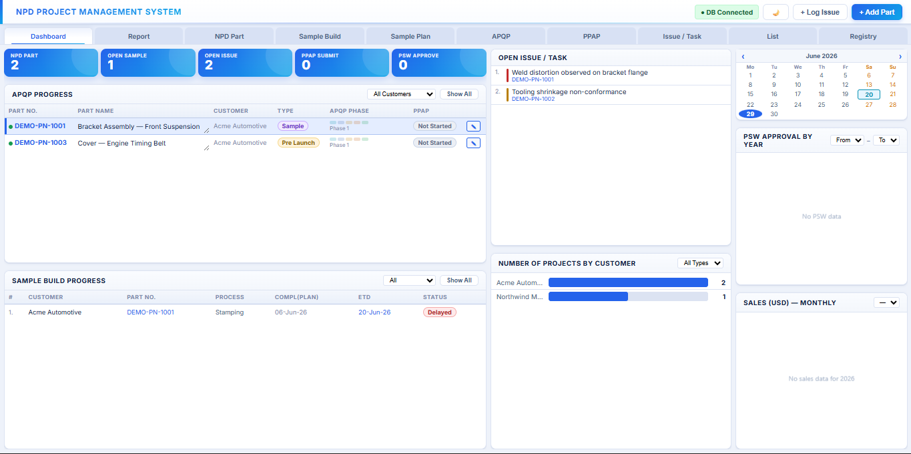
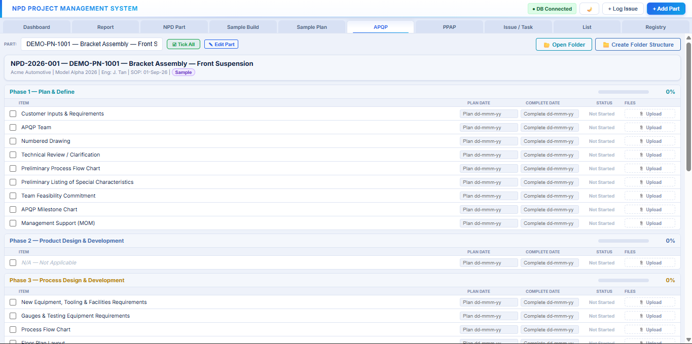
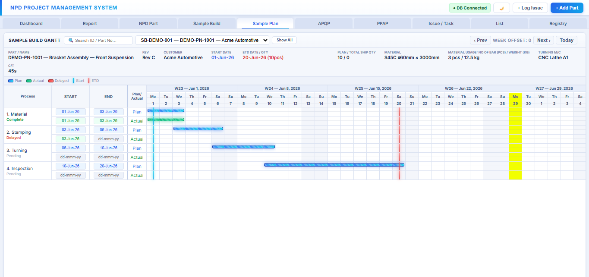
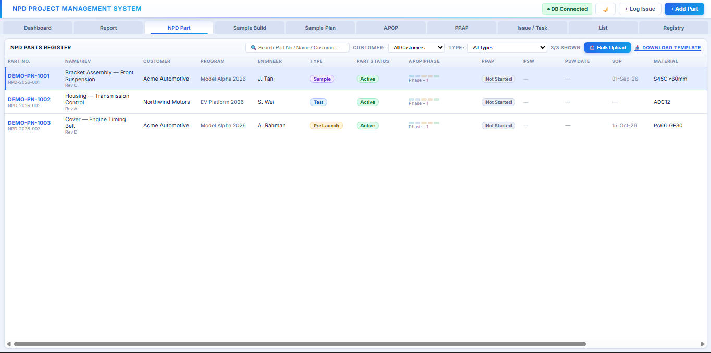
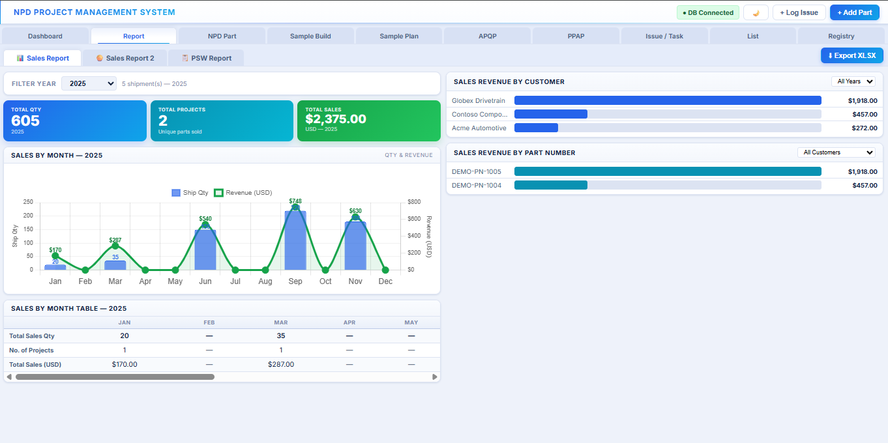
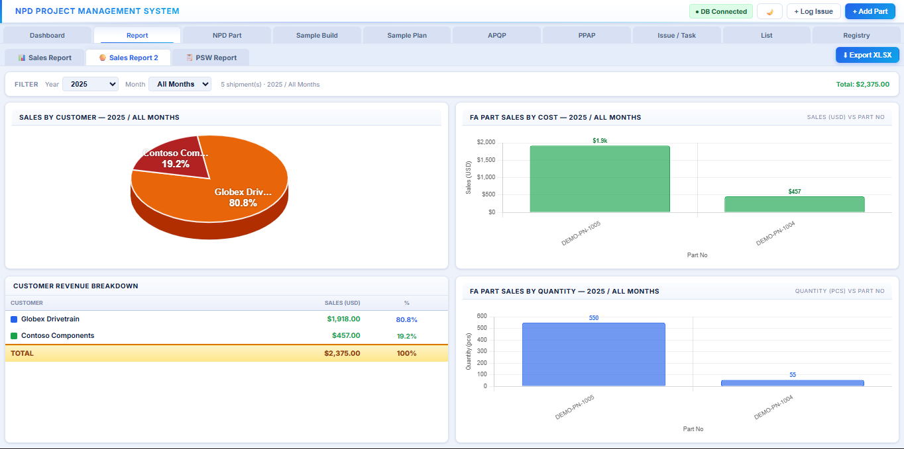

# NPD Project Management System


A full-stack web application for tracking New Product Development (NPD) parts through **APQP** (Advanced Product Quality Planning) and **PPAP** (Production Part Approval Process) workflows in a manufacturing environment — including sample build scheduling, document management, and customer ETD tracking.

> **Origin story:** I built this as a manufacturing/quality engineer, not a developer. Our team was tracking 80+ NPD parts across APQP/PPAP stages using shared Excel files — which meant version conflicts, no audit trail, and zero real-time visibility for management. This project replaced that process with a centralized, multi-user system. It's also the project I used to teach myself full-stack and cloud engineering fundamentals.

🔗 **Live demo:** _[Work In-Progress]_
📺 **Walkthrough:** _[Work In-Progress]_

> All screenshots below use fictional demo data (`backend/seed-demo-data.js`) — no real customer or business information.

---

## Screenshots

### Dashboard — real-time KPIs, open issues, customer breakdown


### APQP Tracker — phase-by-phase checklist with document upload per item


### Sample Build Gantt — plan vs. actual timeline, multi-ETD shipment tracking


### NPD Part Register — full part list with bulk Excel upload


### Sales Report — Full View of Sales Performance by Month / Years


---

## The Problem

Manufacturing NPD teams commonly track project status — APQP checklist completion, PPAP document approval, sample build shipment dates — in Excel files stored on individual laptops. This causes:

- **No single source of truth** — multiple copies of the same file, edited independently
- **No audit trail** — can't prove when an APQP milestone was completed for customer/IATF 16949 audits
- **No real-time visibility** — management has to ask engineers for status updates
- **Data loss risk** — a corrupted file or a laptop failure can erase months of project history

## The Solution

A browser-based system where the whole engineering team works against one shared database, with:

- **APQP checklist tracking** per part, per phase, with plan/actual dates and document attachments
- **PPAP checklist + PSW (Part Submission Warrant) status tracking**
- **Sample build Gantt chart** with multiple ETD (Estimated Time of Delivery) shipments, each with its own quantity
- **Document management** — auto-creates a folder structure per part (`Project/{PartNo}/APQP/{Phase}/{Item}/`) and lets users upload/view documents directly from each checklist item
- **Bulk part upload** via Excel, with smart matching against existing customers/materials/processes
- **Dashboard** with KPIs, customer breakdown, PSW approval trends, and sales charts

---

## Architecture

```
┌─────────────┐      HTTP/JSON       ┌──────────────┐      SQL       ┌─────────────┐
│   Browser   │ ───────────────────► │   Express    │ ─────────────► │   SQLite    │
│  (HTML/JS)  │ ◄─────────────────── │   (Node.js)  │ ◄───────────── │  Database   │
└─────────────┘                      └──────────────┘                └─────────────┘
                                            │
                                            ▼
                                    ┌──────────────┐
                                    │ File System  │
                                    │ (Project/*)  │
                                    └──────────────┘
```

**Frontend:** Vanilla JavaScript single-page app (no framework) — chosen deliberately to keep the project framework-agnostic and easy to deploy as a static asset
**Backend:** Express.js REST API
**Database:** SQLite via Node.js 22's built-in `node:sqlite` module (no native compilation required — important since this originally had to run on a locked-down corporate laptop without admin rights)
**File storage:** Local filesystem, organized per-part / per-APQP-phase

---

## Tech Stack

| Layer | Technology |
|---|---|
| Frontend | HTML5, CSS3, vanilla JavaScript |
| Excel import/export | SheetJS (bulk upload parsing), ExcelJS (report export with native charts) |
| Backend | Node.js 22, Express.js |
| Database | SQLite (`node:sqlite`) |
| File uploads | Multer |
| Containerization | Docker, Docker Compose |
| Cloud _(in progress)_ | AWS — see [`docs/cloud-migration.md`](docs/cloud-migration.md) |

---

## Local Development

### Option A — Docker (recommended)

```bash
git clone https://github.com/fathinzy/npd-project-management.git
cd npd-project-management

docker compose up --build
```

The app is available at `http://localhost:3001`. Data persists in named Docker volumes (`npd-data`, `npd-uploads`) across container restarts.

To seed fictional demo data into the running container:
```bash
docker compose exec backend node seed-demo-data.js
```

### Option B — Run directly with Node.js

#### Prerequisites
- Node.js **22+** (for the built-in `node:sqlite` module)

#### Setup

```bash
git clone https://github.com/fathinzy/npd-project-management.git
cd npd-project-management/backend

npm install
cp .env.example .env

# Start the server
npm start
```

The server starts at `http://localhost:3001` and serves the frontend automatically.

### Load demo data (optional)

The repo ships with **zero real business data** — only this fictional demo seed:

```bash
# With the server running in another terminal:
node seed-demo-data.js
```

This populates the database with sample customers, parts, and a sample build — entirely fictional, safe to explore.

---

## Project Structure

```
.
├── docker-compose.yml          # One-command local startup
├── .dockerignore
├── backend/
│   ├── Dockerfile
│   ├── server.js               # Express API + SQLite schema
│   ├── seed-demo-data.js       # Fictional demo data seeder
│   ├── package.json
│   └── .env.example
├── frontend/
│   └── index.html              # Single-page app (served by backend)
├── docs/
│   ├── architecture.md
│   ├── cloud-migration.md      # AWS migration notes & decisions
│   ├── lessons-learned.md
│   └── screenshots/
└── README.md
```

---

## Key Features in Detail

### APQP Tracking
Each part has a 5-phase APQP checklist (per AIAG framework). Each item has:
- A checkbox + plan date + complete date (auto-calculates status: Not Started / In Progress / Complete)
- A document upload button — files save directly to that item's folder on disk, viewable in-browser

### Multi-ETD Sample Build Scheduling
Real manufacturing sample builds often ship in multiple partial shipments. The Gantt chart supports unlimited ETD dates per build, each with its own quantity, all visualized as markers on the same timeline.

### Bulk Excel Upload
Engineers can upload dozens of parts at once via a provided Excel template. The backend does **name-based matching** against existing Customers/Materials/Processes (auto-creating them if new) — and never overwrites existing parts, only skips duplicates.

### Report Generation — Excel export with native, editable charts
The Report tab covers three report types, each viewable in-browser and exportable to a genuinely native `.xlsx` file:

- **Sales Report** — shipped quantity, project count, and revenue, broken down by year or by month within a selected year, with a combo bar+line chart
- **Sales Report 2** — revenue distribution as a pie chart, plus per-part cost/quantity breakdowns
- **PSW Report** — Part Submission Warrant approval counts by year and by month, tracking PPAP approval velocity over time

The Excel export is built client-side with [ExcelJS](https://github.com/exceljs/exceljs) (loaded on demand from CDN to keep the base page light) — it doesn't just dump a data table, it generates **real Excel chart objects** wired to the data via cell references, so anyone opening the file in Excel can click into a chart and see (or edit) the exact source range, the same as if they'd built the chart manually. Styling (header fills, currency number formats, column widths) is applied programmatically to match the in-app look.

---

## What I Learned

This was my first production-style full-stack project, building on a manufacturing engineering background with no prior web development experience. Honest list of firsts:

- First time writing a REST API and designing a relational schema from scratch
- First time handling file uploads, async race conditions, and partial-update bugs in a real (not tutorial) app — see [`docs/lessons-learned.md`](docs/lessons-learned.md) for specific bugs I hit and fixed
- First time deploying outside of `localhost` — see the cloud migration docs for that journey

---

## Cloud Migration (in progress)

This project was originally deployed on a single office PC on a LAN. I'm migrating it to AWS to apply cloud engineering fundamentals — containerization, managed databases, CI/CD, and infrastructure as code. Progress and architecture decisions are documented in [`docs/cloud-migration.md`](docs/cloud-migration.md).

---

## License

MIT — feel free to use this as a reference for your own NPD tracking needs.
